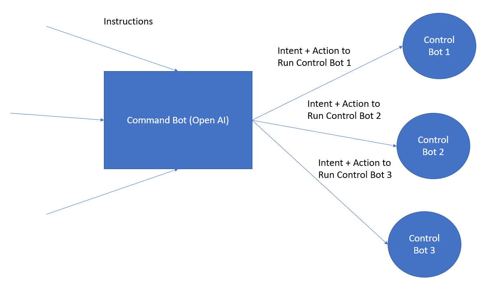

# openai-command-bot

You can do a lot of stuff without training Open AI. Use it as a command bot to transfer intent and action to control AI bot.

It will work as orchestrator bot and your private AI Model can perform work based on instructions shared

Below diagram highlights the high level idea

